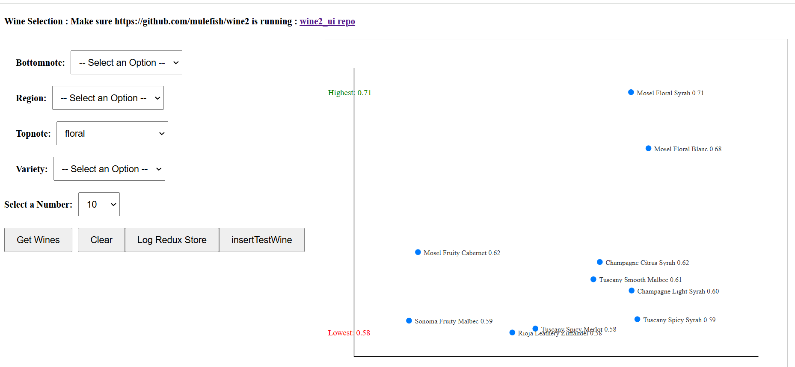

# REPO
https://github.com/mulefish/wine2_ui

# Purpose
GloVe based VECTOR search over a 'wine store' of made up data

# Dependencies
https://github.com/mulefish/wine2  
post-gres  
python  
GloVe  
React  

# Screenshot

